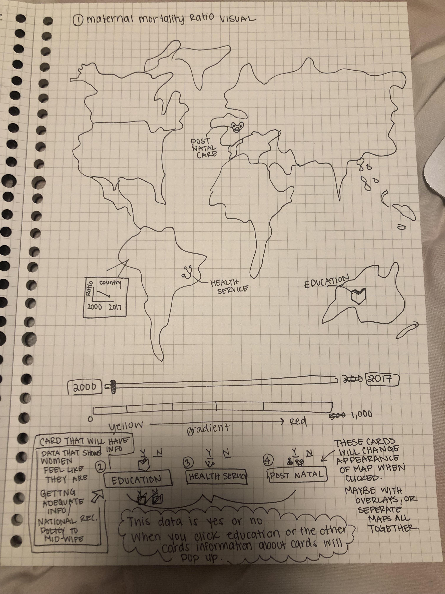

<h1>Maternal Mortality Ratio</h1>

UN's sustainabilty goal 3 is to ensure healthy lives and promote well being for all at all ages. This includes a target of reducing global mortality ratio to less than 70 per 100,000 live births where the maternal mortality ratio serves as an indicator for this target. After reviewing this data it was alarming to find out that the United States had one of the worst maternal mortality ratios of developed countries, and as most countries rates were decreasing, the US continues to increase. 

Every year 700-900 women die from pregnancy or childbirth related causes (https://www.npr.org/2017/05/12/527806002/focus-on-infants-during-childbirth-leaves-u-s-moms-in-danger). Ameriacn women are more than 3x as likely as Canadian women to die in the maternal perioed and 6x than Scandanavian women. 60% of these deaths are preventable. 

<h2> Original Sketch </h2>

From the three datasets I selected last week, I decided to visualize the maternale mortality rate. I used the heat map concept I envisioned for women in senior managerial positions and decided to use it for maternal mortality (Sketches are found in images folder under Maternal Mortality and Women in Managerial Positions). 

I thought that it would interesting to see how United States maternal mortality ratio compares to countries with most desirable maternal care as well as least desireable. Maternal care in this case encapsulates health care, parental leave, and education. The counties I chose were Austria, Finland, Norway, Japan, and the United States. I selected a heat map because I thought this would be a good way to show how the ratio gradually changes over time. The "heat map" has a legend from cool to warm colors to indicate a lower to higher ratio value. The heat map shows change over time. I noticed that even though I labeled each square on the visualization the legend will always have to be referenced in order to understand the ratio for each year. Along with that, I believe this might not capture the story I wish to tell which is how common factors contributing to death like lack of education, and access to care need to dramatically change in countries to ensure a mother's safety and life.  I think it is important to compare countries policies to show what might be working to decrease this ratio. 

figma

<h2>Second Sketch</h2>

After thinking about it further and our class discussion on Tuesday- I decided to have a global map which showed data of 3 contributing factors to maternal mortality- Education, Health Services, and Post natal care. The inital visualization would be the maternal mortality ratio with an interactive sliding tool to change view from 2000-2017. The intial visualization would have color go from yellow to red for low to high ratio values. I chose these colors because I think typically red indicates a level of danger where yellow indicates warning. I think its best not to include green or colors that would indicate something positive because this topic is serious and when the percentage for preventable deaths are so high (60%). I would like to include a hovering element as well to show how each countries maternal ratio has changed. This hover will include a small line graph to show the granular data. 

At the bottom of the page I would like to display three cards- education, health service, and post natal care. These cards will show how mothers and newborns are assisted during the pregnancy process in order to see correlation. When the education, health service, or post natal care card is selected information pertaining to the data will be displayed along with a legend to demarcate which countries have a national policy or offer these services- maybe a book for education, a stethscope for health service, and a pacifier for post natal care. I believe that this will work since the data are yes or no responses. When the cards are clicked the interactive year scale would have to be inactive because the data is linked to certain years. 

 
 <h2>Design Mockup</h2>

