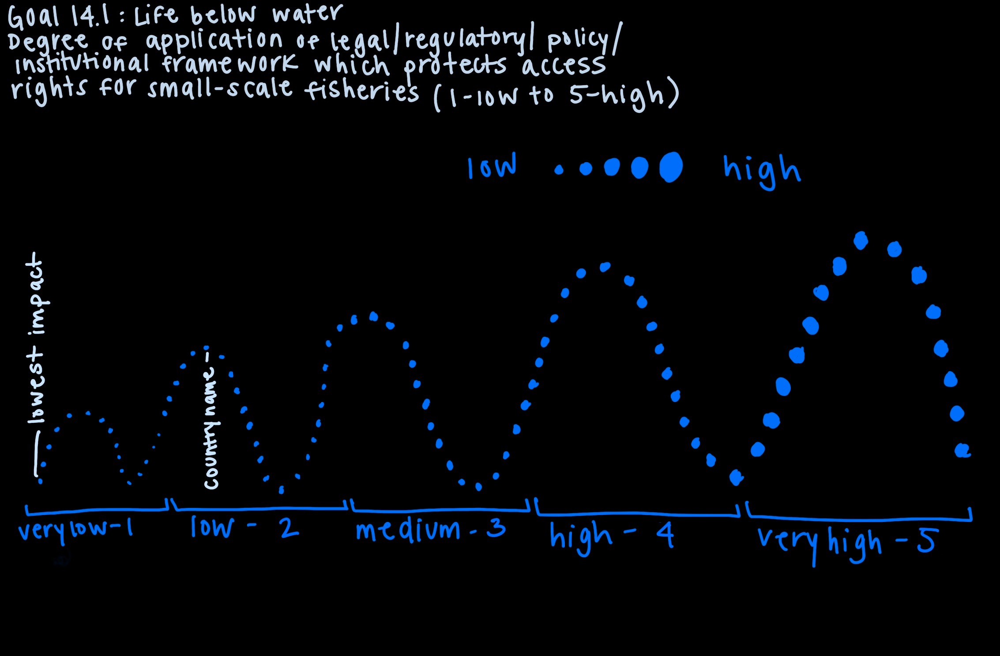

<h1> Goal 14.1 Life Under Water </h4>

This visualization shows the degree of application of a legal/regulator/policy/instituational framework which recognizes and protects access rights for small-scale fisheries. In order to guarantee secure access, an enabling environment is necessary which recognizes and protects small-scale fisheries rights. According to the FAO (Food and Agricultural Organization), "Artisinal, or small scale fisheries, are traditional fisheries involving fishing households (as opposed to commercial companies), using relatively small amount of capital and energy, relatively small fishing vessels (if any), making short fishing trips, close to shore, and mainlu for local consumption."

Importance of small-scale fisheries:

- "Over half of the catch in developming countries is produced by the small-scale sub-sector and 90-95 percent of the small-scale landings are destined for local human consumption."

- "Large-scale fisheries land more fish, but small-scale fisheries produce more fish for domestic human consumption."

